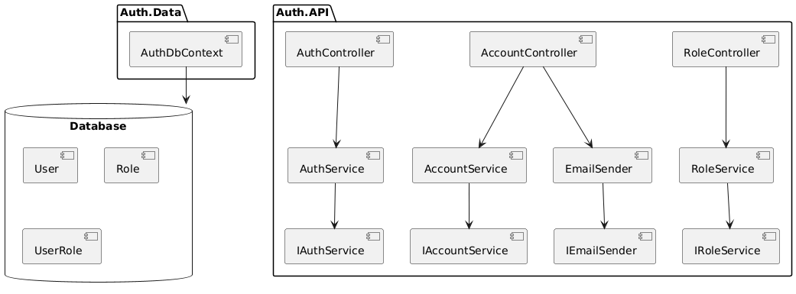

# Структура проекта 

Данное решение состоит из двух проектов, для того чтобы отделить бизнем модель от бизнес логики. 

### Структура API

Для удобства работы и гибкости мы вместо MinimalAPI используем Контроллеры. 

Каждый контроллер привязан к классу более нижнего уровня, то есть к сервису. 

Для того чтобы возвращать целостные, но при этом правильные данные мы используем **ResultPattern**.

Для реализации ResultPattern мы создали 3 класса. 
- Result 
- PaginatedResult
- TypedResult 

По этой же логики для запросов я создал DTO(Data Transfer Objects)

Чтобы при запросе пользователя вручную не создавать объекты из модели, я реализовал 
автоматическую привязку DTO к модели с помощью AutoMapper. 

Чтобы избавиться от большого метода Main в классе **Program**, не забываем при этом про 
Top Level Statements, я создал папку Exntesions. 

В ApplicationServiceExtensions я заркгестрировал в свой DI Container все контроллеры
, сервисы и middlewares. 

Чтобы мой контроллер был маленький и понятный, я реализовал `GlobalExceptionsMiddleware`. 

В `ApplicationBuilderExtensions` я уже использую все то, что ранее зарегистрировал в 
`ApplicationServiceExtensions`. 

В проекте `Auth.Data` из того к чему вы не привыкли я вынес `FluentApi` конфигурацию в отдельные 
файлы в папке Configurations. 

# JWT 

Для аутентификации и авторизации я использую JWT. Для этого мне нужно прописать его 
конфигурацию в `appsettings.json` и зарегистрировать его в `ApplicationServiceExtensions`
как метод аутентификации по умолчанию. 

с помощью Claims я записал полезную информацию о пользователе в токен и передал ему при 
логине. 

С помощью Policy я создал политику авторизации, которую стал использовать в контроллере. 

# Email Verifiсation

Для того чтобы реализовать подтверждение аккаунта по ссылке, которая приходит на почту 
нам нужно будет изрядно так постараться. 

1. Создать Email конфигурацию в `appsettings.json`
2. Создать EmailSender и наоследовать его от IEmailSender, который уже есть в ASP.NET 
3. Создать папку wwwroot и хранить там статичные файлы, например `confirmationMessage.html`
4. Реализовать создание токена для подтверждения почты со временем 3 минуты
5. Дописать AccountController 

